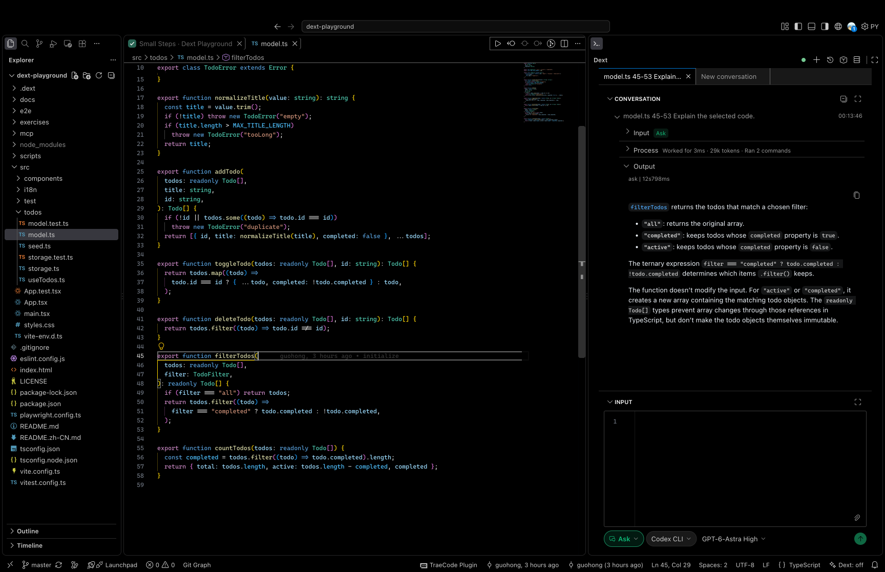
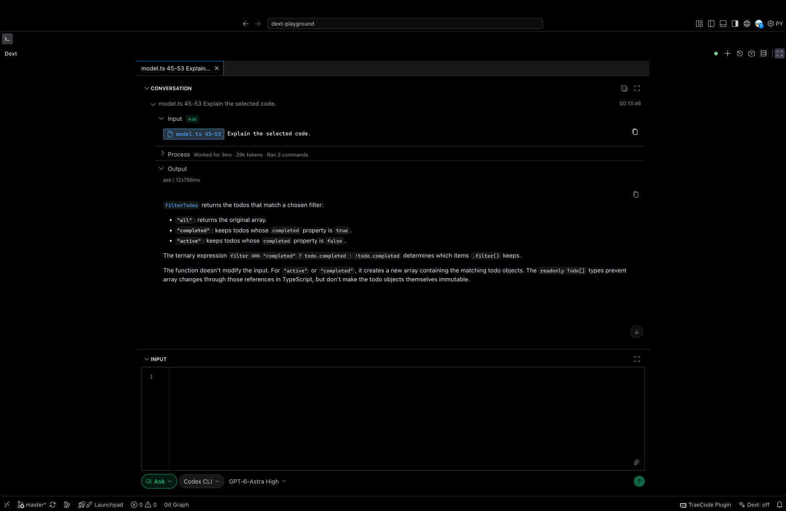
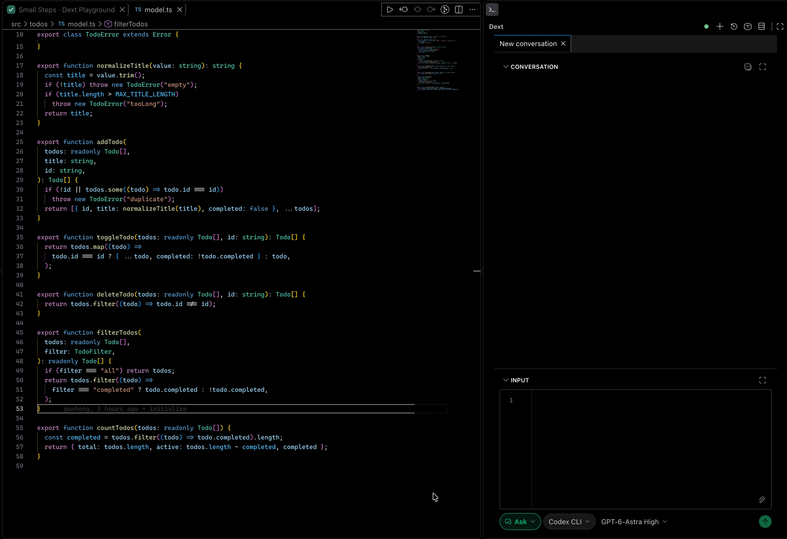
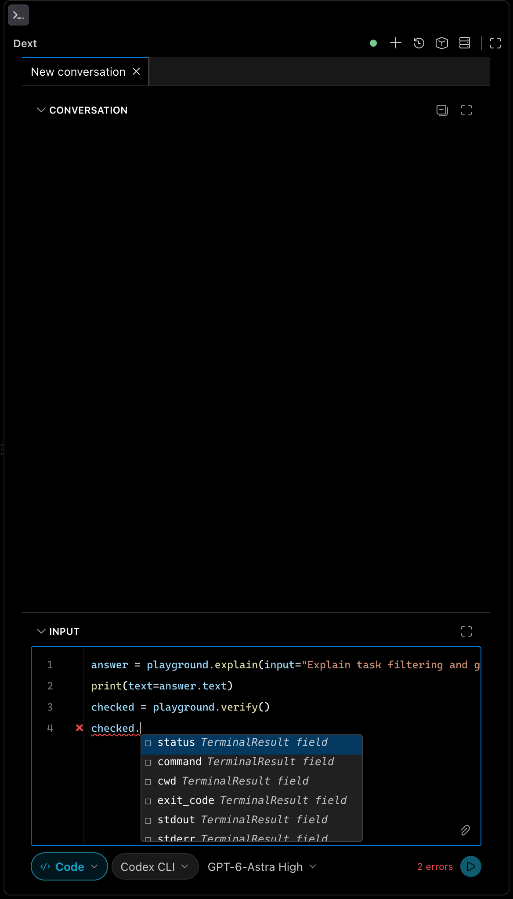
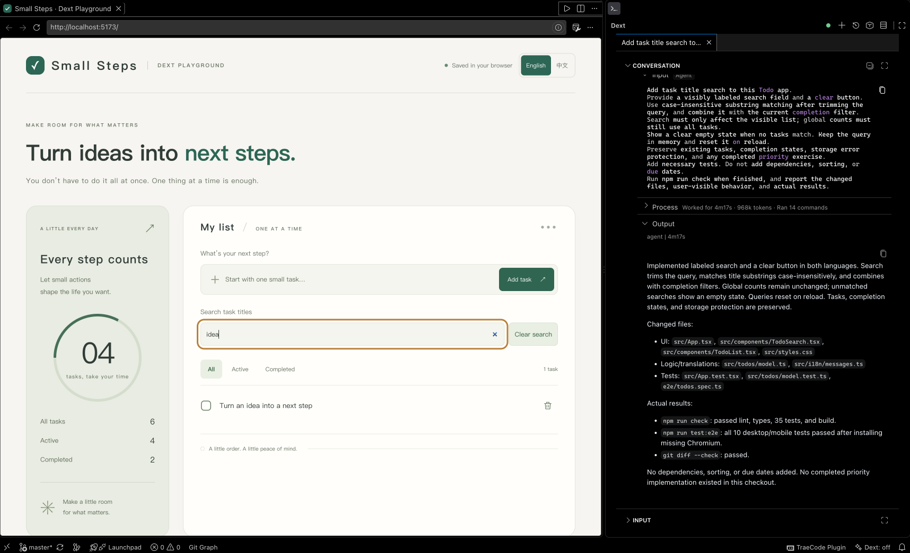

# Dext

[English](README.md) | 简体中文

Dext 是一款支持 AI 对话与类型化工作流的 Visual Studio Code 插件。你可以提问、委托代码修改、制定和执行计划，也可以通过 API、Skills 和 MCP 工具将重复任务变成可复用的工作流。



<details>
<summary>查看全屏布局</summary>



</details>

## 能做什么

| 模式 | 用途 | 输入 |
| --- | --- | --- |
| **Ask** | 理解代码、分析问题，不修改文件 | 自然语言 |
| **Agent** | 实现功能、修复问题、运行检查 | 自然语言 |
| **Plan** | 创建和修订计划，再点击 **Build** 实施 | 自然语言 |
| **Code** | 组合 API 调用，编写类型化工作流 | 工作流代码 |

你可以将文件和代码选区加入上下文，在 History 中继续对话，并从对话生成起始工作流。Code 模式提供 API 补全、参数提示、诊断和类型化结果字段。

支持 **Codex CLI、Claude CLI 和 DeepSeek Harness**，也可以单独配置用于源代码行内补全的模型。

## 安装

需要 **VS Code 1.105 或更新版本**。执行 AI 任务前，请安装并登录其中一个受支持的 Agent CLI，Dext 使用该 CLI 的登录凭据。

1. 从 [GitHub Releases](https://github.com/blooddot/dext/releases) 下载 `dext-<版本号>.vsix`。
2. 打开 VS Code 命令面板，执行 **Extensions: Install from VSIX...**（扩展：从 VSIX 安装）。
3. 选择下载的文件；如果出现提示，重新加载 VS Code。

更新时安装新版 VSIX 即可。从源码构建见[开发指南](docs/development.zh-CN.md)。

## 快速上手

1. 在 VS Code 中打开项目文件夹，点击活动栏中的 Dext，或执行 **Dext: Focus Input**。
2. 在输入区域选择 Agent 和模型；如果选项未显示，展开 **More options（更多选项）**。需要修改可执行文件路径时，执行 **Dext: Configure Agent**。
3. 选择 **Ask**，输入“解释这个项目的结构”，点击 **Send**。需要分析具体代码时，在编辑器中选中代码，再点击 **Add to Dext**。
4. 需要修改代码时，选择 **Agent**。项目内修改使用 **Workspace write**；**Full access** 允许更广泛的访问。

较大的任务可以先选择 **Plan**，创建和修订实施计划。选中最终计划后，在同一模式点击 **Build** 执行。



*Ask 操作演示：选中代码 → Add to Dext → 输入“Explain the selected code.”。*

## 编写工作流

选择 **Code**，输入以下代码并点击 **Run**：

```python
answer = ask(input="解释这个项目的结构")
print(text=answer.text)
```

工作流使用 Python 的一小部分语法，由 Dext 自行解析和校验，**不需要 Python 解释器**。API 参数和结果字段都支持补全与类型检查。

可复用的 API 以 `.dx` 文件保存在 `.dext/api/` 中。例如，创建 `.dext/api/team/analyze.dx`：

```python
from common import ask

def main(input: str) -> ChatResult:
    return ask(input=input)
```

在 Code 模式中，可以直接调用 `team.analyze(input="...")`，也可以导入后使用简短名称：

```python
from team import analyze

answer = analyze(input="解释任务筛选逻辑和相关测试")
print(text=answer.text)
```

项目 API 需要受信任的工作区。你也可以右键 History 条目，选择 **Record Conversation as Dext Workflow**，生成起始文件后继续编辑。组合调用、Skills、规则和交互确认见[工作流与 API 参考](docs/workflows.zh-CN.md)。

<p align="center">
  <a href="docs/images/dext-workflow-completion.png"></a>
</p>

*输入 `checked.` 时的字段补全。图中的 `playground.*` API 来自 Dext Playground。*

## 跟着 Playground 练习

[Dext Playground](https://github.com/blooddot/dext-playground) 是配套的 Todo 应用和实作教程。先运行应用，让 Dext 解释代码，再完成一次看得见的修改；之后按需练习计划、功能开发、测试、可复用 API 和 MCP 工具。

[开始首次体验](https://github.com/blooddot/dext-playground/blob/master/docs/getting-started.md)。



*完成搜索练习后的效果：列表按关键词展示匹配任务，全局统计保持不变。*

## 详细文档

| 文档 | 内容 |
| --- | --- |
| [工作流与 API](docs/workflows.zh-CN.md) | 语法、内置与自定义 API、上下文、Skills、规则和 History |
| [Agent 配置](docs/agents.zh-CN.md) | CLI 配置、模型覆盖、DeepSeek Harness 预设与权限 |
| [MCP 配置](docs/mcp.zh-CN.md) | 工具清单、类型化结果、传输方式和凭据 |
| [行内补全](docs/completion.zh-CN.md) | 模型配置、接口格式和调优 |
| [开发与发布](docs/development.zh-CN.md) | 本地开发、检查、打包、发布和架构 |

## 反馈与许可证

通过 [GitHub Issues](https://github.com/blooddot/dext/issues) 反馈问题或提出功能建议。请提供 Dext 和 VS Code 版本、复现步骤，以及移除凭据后的相关日志。

Dext 采用 [PolyForm Perimeter License 1.0.1](LICENSE)，并可另行协商商业授权。在遵守许可证的前提下，允许日常使用，包括企业内部使用。利用 Dext 向他人提供竞争性产品或服务，需要另行授权，即使该产品或服务免费提供。

授权范围与申请方式见[商业授权说明](COMMERCIAL-LICENSING.md)。本项目属于源码可见软件，不采用 OSI 认可的开源许可证。第三方组件继续遵循各自许可证。版本记录见 [CHANGELOG.md](CHANGELOG.md)。
